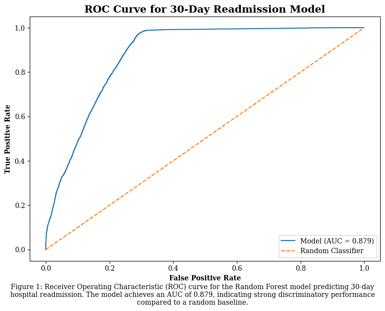
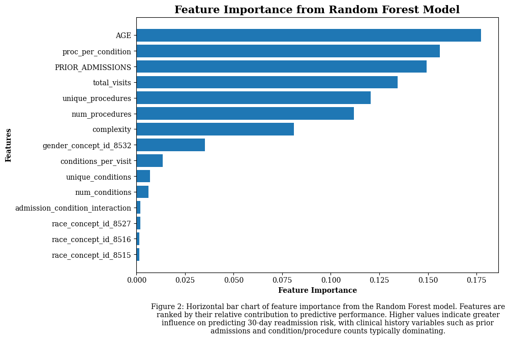
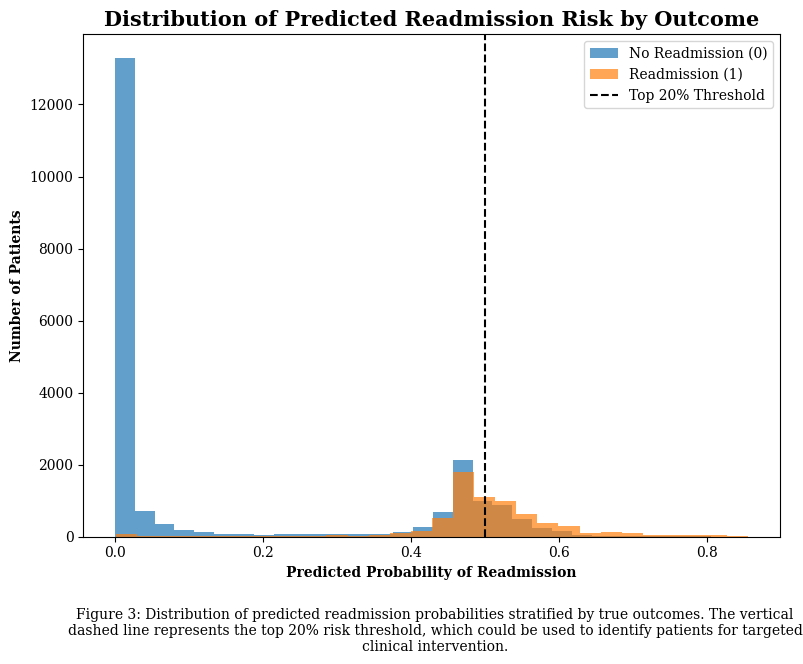
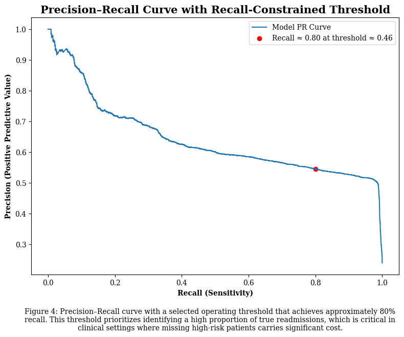

# Press Release

# Headline: Using Machine Learning to Predict Hospital Readmission Risk for Patients within 30 Days

## Hook: What if hospitals could identify patients most likely to return before they even leave?

## Problem Statement
Hospital readmissions within 30 days continue to represent a critical and costly challenge for healthcare systems. A significant number of patients are discharged only to return shortly after due to complications, gaps in post-discharge care, medication mismanagement, or underlying chronic conditions that require closer monitoring. These readmissions not only increase operational costs but also indicate missed opportunities to provide timely and effective interventions.

Although hospitals collect large amounts of patient data, this information is often not fully leveraged in a systematic way to predict readmission risk. Instead, many institutions rely on broad guidelines or clinician judgment, which may not consistently capture the complex interactions between patient history, diagnoses, prior admissions, and other contributing factors. This can lead to situations where high-risk patients are not identified early enough, while limited resources are spent on individuals who may not require intensive follow-up.

Another key challenge is that healthcare providers must balance competing priorities when identifying at-risk patients. In practice, it is often more important to correctly identify as many high-risk patients as possible (high recall) rather than achieving perfect overall accuracy. Without a structured and data-driven approach to prioritization, hospitals may struggle to consistently meet this goal. As a result, opportunities to intervene early, through follow-up care, patient education, or coordinated discharge planning, may be missed, contributing to avoidable readmissions and increased strain on healthcare systems.

## Solution Description
This project introduces a predictive modeling pipeline that estimates the likelihood of 30-day hospital readmission for individual patients. The model is trained on historical patient data and produces a risk score for each patient, representing their relative likelihood of being readmitted. These scores allow healthcare providers to rank patients by risk and focus attention on those who are most likely to benefit from additional support after discharge.

Rather than treating all patients equally, the system enables a targeted approach to care management. For example, patients identified as higher risk can be prioritized for follow-up appointments, discharge planning support, medication reconciliation, or outreach from care coordinators. This helps ensure that limited hospital resources are allocated where they can have the greatest impact on preventing readmissions.

In evaluating the model, special emphasis is placed on its ability to identify high-risk patients effectively. Metrics such as the precision-recall tradeoff and recall are used to guide decision-making around the selection of a risk threshold. In this context, a threshold can be chosen to prioritize capturing a larger proportion of actual readmissions, even if it means flagging more patients overall. This reflects the practical goal of minimizing missed high-risk cases.

Overall, the solution translates complex patterns in patient data into actionable insights that are easy for clinicians and administrators to interpret. By integrating these predictions into clinical workflows, healthcare teams can make more informed, proactive decisions, ultimately improving patient outcomes and reducing the rate of avoidable hospital readmissions.

## Charts

