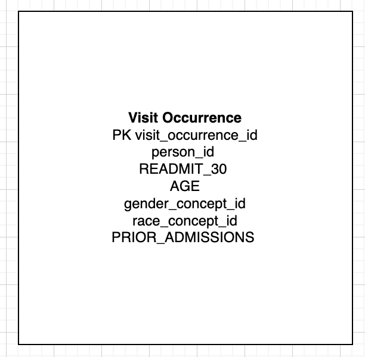

# DS 4320 Project 1: Predicting Hospital Readmission Risk

Executive Summary - Short paragraph explaining the
contents of the respository in executive form

Name: Kylie Stephens 

NetID: uqj5uw

DOI - create a DOI for your project — 

Link to Press Release: https://colab.research.google.com/drive/1Tr1MRzhJRW3NbFYXslC7sI61albDhwy_?usp=sharing— —

Link to Data (One Drive Folder) - https://myuva-my.sharepoint.com/:f:/g/personal/uqj5uw_virginia_edu/IgC1jn9UyYwbR6PRk7h_LHseAS4iLyl0_66hQn3Np171KBY?e=QTEY12

Pipeline: https://colab.research.google.com/drive/1EuoAJhddXGdDML7ycRt_NIKFSMER9cga?usp=sharing — 

License State: MIT License 

## Problem Definition
General- Hospital readmissions are a major challenge in healthcare systems. Patients who return to the hospital shortly after discharge often experience poorer health outcomes, and hospitals face financial penalties from insurers and government programs for excessive readmission rates.

Refined - This project focuses on predicting the risk of hospital readmission within 30 days after discharge using patient data such as demographics, diagnoses, prior admissions, and length of stay. The goal is to develop a predictive model that identifies high-risk patients before discharge so healthcare providers can intervene early.

The general problem of hospital readmissions is broad and involves many systemic healthcare issues such as staffing, patient behavior, and hospital resources. To make the problem manageable within a data science project, the scope was refined to predicting 30-day readmission risk using available patient data. Thirty-day readmission is a widely used benchmark in healthcare quality metrics and is commonly used by programs such as Medicare when evaluating hospital performance. Focusing on this specific timeframe allows the project to use measurable outcomes and structured datasets while still addressing a meaningful healthcare challenge.

Predicting hospital readmissions has significant implications for both patient health and healthcare costs. Patients who are readmitted soon after discharge may not have received adequate follow-up care or may suffer complications from their original condition. Hospitals are also financially impacted because many healthcare systems impose penalties for high readmission rates. By identifying patients at high risk of readmission, healthcare providers can implement targeted interventions such as follow-up appointments, medication management, or additional monitoring. A predictive model could therefore improve patient outcomes while also helping hospitals allocate resources more effectively.

Headline of Press Release and link to press release
Headline- AI Model Predicts Hospital Readmission Risk to Improve Patient Care
Link to Press Release Markdown: https://github.com/kyliestephens-2004/design_project1/blob/main/Press-Release.md

## Domain Exposition

| Term                            | Definition                                                                                   |
| ------------------------------- | -------------------------------------------------------------------------------------------- |
| Hospital Readmission            | When a patient is admitted to a hospital again within a specific time period after discharge |
| 30-Day Readmission              | A common healthcare quality metric measuring readmission within 30 days                      |
| Predictive Model                | A machine learning model that forecasts future outcomes based on data                        |
| Electronic Health Records (EHR) | Digital records of patient medical history and hospital visits                               |
| Risk Score                      | A numerical estimate representing the likelihood of a particular outcome                     |
| Healthcare KPI                  | A key performance indicator used to measure hospital performance                             |

This project exists within the healthcare analytics and predictive medicine domain. Healthcare organizations collect large volumes of patient data through electronic health record systems. Data science techniques allow analysts to use this data to identify patterns and predict health outcomes. Predictive analytics is increasingly used in hospitals to support clinical decision-making, optimize patient care, and reduce operational costs. One of the most widely studied problems in healthcare analytics is hospital readmission because it directly impacts both patient wellbeing and healthcare system efficiency. By analyzing patient demographics, diagnoses, and treatment history, predictive models can estimate the probability that a patient will return to the hospital after discharge.

| # | Title                                                                                   | Brief Description                                                                                               | Link                                                  |
| - | --------------------------------------------------------------------------------------- | --------------------------------------------------------------------------------------------------------------- | ----------------------------------------------------- |
| 1 | Predictive Modeling of the Hospital Readmission Risk                                    | Discusses machine learning models for hospital readmission prediction using claims data and EHR features.       | https://github.com/kyliestephens-2004/design_project1/blob/main/Background-Readings/A1.pdf               |
| 2 | Assessment of Machine Learning vs Standard Prediction Rules                             | Compares traditional readmission scoring rules with machine learning approaches to improve prediction accuracy. | https://github.com/kyliestephens-2004/design_project1/blob/main/Background-Readings/ML.pdf          |
| 3 | Predicting Hospital Readmission Using Data Mining Techniques                            | Explores data mining techniques to identify high-risk patients for readmission in hospitals.                    | https://github.com/kyliestephens-2004/design_project1/blob/main/Background-Readings/datamining.pdf|
| 4 | Machine Learning Methods to Predict 30‑day Hospital Readmission                         | Uses national patient data to develop ML models predicting 30-day readmission risk.                             | https://github.com/kyliestephens-2004/design_project1/blob/main/Background-Readings/ML-30.pdf          |
| 5 | Machine Learning‑Based Prediction Model for 30‑day Readmission Risk in Elderly Patients | Focuses on elderly patients with comorbidities; evaluates ML performance in real-world clinical settings.       | https://github.com/kyliestephens-2004/design_project1/blob/main/Background-Readings/T2.pdf                |

## Data Creation 
  This project uses synthetic healthcare data generated by Synthea, an open-source tool designed to simulate realistic electronic health records. The dataset was accessed through the publicly available Synthea OMOP dataset hosted via AWS Open Data. This dataset contains patient-level and encounter-level information formatted according to the OMOP Common Data Model, which is widely used in healthcare analytics.
  The raw data includes multiple relational tables such as patient demographics (person.csv) and healthcare encounters (visit_occurrence.csv). These tables were downloaded in compressed .lzo format, decompressed in a cloud-based Python environment (Google Colab), and processed using pandas. The final dataset was constructed by filtering inpatient visits, computing a 30-day readmission outcome variable, and merging patient demographic data with visit-level data.

Link to Code for Data Assembly: https://github.com/kyliestephens-2004/design_project1/blob/main/data_assembly.ipynb

Bias may be introduced due to the synthetic nature of the data. Although Synthea simulates realistic patient records, it does not perfectly replicate real-world healthcare utilization patterns. For example, the dataset exhibited a higher-than-expected rate of 30-day readmissions, likely due to the frequency and structure of simulated encounters. Additionally, demographic distributions (e.g., race, age) may not accurately reflect real populations, introducing representation bias.

To address these biases, several strategies can be applied. First, model evaluation should rely on metrics beyond accuracy, such as precision, recall, and F1-score, to account for class imbalance. Second, resampling techniques or class weighting can be used during model training. Finally, results should be interpreted with caution, acknowledging that synthetic data may not generalize to real-world populations.

Several key decisions were made during data processing. First, inpatient visits were selected using visit_concept_id = 9201, as these represent hospital admissions relevant to readmission prediction. Second, a 30-day readmission variable was constructed by calculating the time difference between consecutive visits for each patient.

A critical challenge involved ensuring data integrity during table joins. Initially, merging visit and patient data resulted in duplicated rows due to non-unique patient identifiers in the demographic table. This was resolved by deduplicating the patient table prior to merging, ensuring a one-to-many relationship between patients and visits. This step highlights the importance of verifying join keys to avoid unintended data inflation.

Uncertainty is also introduced through feature engineering decisions, such as how readmission is defined and how prior admissions are counted. These choices can influence model performance and interpretation.

## Metadata

| Feature           | Type          | Description                                                 | Example |
| ----------------- | ------------- | ----------------------------------------------------------- | ------- |
| person_id         | Integer       | Unique identifier for each patient                          | 12345   |
| READMIT_30        | Integer (0/1) | Indicates whether the patient was readmitted within 30 days | 1       |
| AGE               | Integer       | Patient age in years at time of visit                       | 67      |
| gender_concept_id | Integer       | Encoded gender from OMOP vocabulary                         | 8507    |
| race_concept_id   | Integer       | Encoded race from OMOP vocabulary                           | 8527    |
| PRIOR_ADMISSIONS  | Integer       | Number of prior hospital visits for the patient             | 3       |
