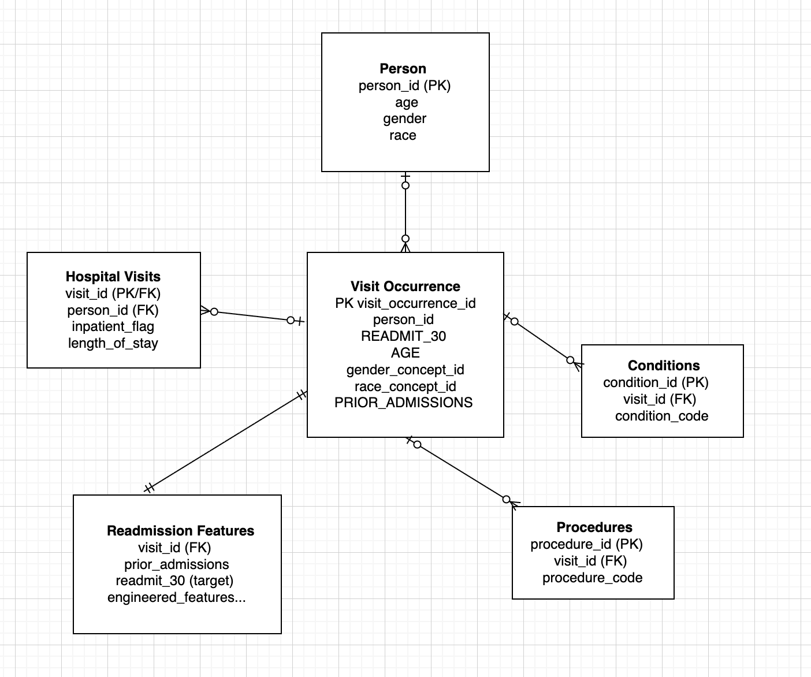

# DS 4320 Project 1: Predicting Hospital Readmission Risk

Executive Summary:

This project explores hospital patient data to build a model that predicts the risk score for a patient to be admitted within the next 30 days. The README contains all links to any necessary jupyter notebooks, code, or other markdown documents. There are folders for background readings regarding the domain of the problem, images used in the press release and of the ERD for the metadata, and a folder containing both the ipynb and md of the problem solution pipeline files. There are also separate files for a press release markdown document, a data creation jupyter notebook, and a license file to have this project listed under the MIT license. The README file follows the project work process and flow starting with problem definition, then moving to domain exposition, data creation, and metadata exploration. Continue reading to find out the exciting details of this project!

Name: Kylie Stephens 

NetID: uqj5uw

DOI: 
— 

Link to Press Release:

https://colab.research.google.com/drive/1Tr1MRzhJRW3NbFYXslC7sI61albDhwy_?usp=sharing— —

Link to Data (One Drive Folder): Contains data in csv and parquet form.

https://myuva-my.sharepoint.com/:f:/g/personal/uqj5uw_virginia_edu/IgC1jn9UyYwbR6PRk7h_LHseAS4iLyl0_66hQn3Np171KBY?e=QTEY12

Pipeline: 
https://colab.research.google.com/drive/1EuoAJhddXGdDML7ycRt_NIKFSMER9cga?usp=sharing — 

License State: MIT License 
Link to License File:

https://github.com/kyliestephens-2004/design_project1/blob/main/LICENSE

## Problem Definition

Problem Statements:

General- Hospital readmissions and predicting them is a major challenge in healthcare system.

Refined - This project focuses on predicting the risk of hospital readmission within 30 days after discharge using patient data such as demographics, diagnoses, prior admissions, and length of stay. The goal is to develop a predictive model that identifies high-risk patients before discharge so healthcare providers can intervene early.

Rationale:

The general problem of hospital readmissions is broad and involves many systemic healthcare issues such as staffing, patient behavior, and hospital resources. To make the problem manageable within a data science project, the scope was refined to predicting 30-day readmission risk using available patient data. Thirty-day readmission is a widely used benchmark in healthcare quality metrics and is commonly used by programs such as Medicare when evaluating hospital performance. Focusing on this specific timeframe allows the project to use measurable outcomes and structured datasets while still addressing a meaningful healthcare challenge.

Motivation:

Predicting hospital readmissions has significant implications for both patient health and healthcare costs. Patients who are readmitted soon after discharge may not have received adequate follow-up care or may suffer complications from their original condition. Hospitals are also financially impacted because many healthcare systems impose penalties for high readmission rates. By identifying patients at high risk of readmission, healthcare providers can implement targeted interventions such as follow-up appointments, medication management, or additional monitoring. A predictive model could therefore improve patient outcomes while also helping hospitals allocate resources more effectively.

Headline of Press Release and link to press release:

Headline: Using Machine Learning to Predict Hospital Readmission Risk for Patients within 30 Days

Link to Press Release Markdown: https://github.com/kyliestephens-2004/design_project1/blob/main/Press-Release.md

## Domain Exposition

Terminology:

| Term                            | Definition                                                                                   |
| ------------------------------- | -------------------------------------------------------------------------------------------- |
| Hospital Readmission            | When a patient is admitted to a hospital again within a specific time period after discharge |
| 30-Day Readmission              | A common healthcare quality metric measuring readmission within 30 days                      |
| Predictive Model                | A machine learning model that forecasts future outcomes based on data                        |
| Electronic Health Records (EHR) | Digital records of patient medical history and hospital visits                               |
| Risk Score                      | A numerical estimate representing the likelihood of a particular outcome                     |
| Healthcare KPI                  | A key performance indicator used to measure hospital performance                             |

Domain:

This project exists within the healthcare analytics and predictive medicine domain. Healthcare organizations collect large volumes of patient data through electronic health record systems. Data science techniques allow analysts to use this data to identify patterns and predict health outcomes. Predictive analytics is increasingly used in hospitals to support clinical decision-making, optimize patient care, and reduce operational costs. One of the most widely studied problems in healthcare analytics is hospital readmission because it directly impacts both patient wellbeing and healthcare system efficiency. By analyzing patient demographics, diagnoses, and treatment history, predictive models can estimate the probability that a patient will return to the hospital after discharge.

Background Readings: https://github.com/kyliestephens-2004/design_project1/tree/main/Background%20Readings

Table for Background Readings:

| # | Title                                                                                   | Brief Description                                                                                               | Link                                                  |
| - | --------------------------------------------------------------------------------------- | --------------------------------------------------------------------------------------------------------------- | ----------------------------------------------------- |
| 1 | Predictive Modeling of the Hospital Readmission Risk                                    | Discusses machine learning models for hospital readmission prediction using claims data and EHR features.       | https://github.com/kyliestephens-2004/design_project1/blob/main/Background-Readings/A1.pdf               |
| 2 | Assessment of Machine Learning vs Standard Prediction Rules                             | Compares traditional readmission scoring rules with machine learning approaches to improve prediction accuracy. | https://github.com/kyliestephens-2004/design_project1/blob/main/Background-Readings/ML.pdf          |
| 3 | Predicting Hospital Readmission Using Data Mining Techniques                            | Explores data mining techniques to identify high-risk patients for readmission in hospitals.                    | https://github.com/kyliestephens-2004/design_project1/blob/main/Background-Readings/datamining.pdf|
| 4 | Machine Learning Methods to Predict 30‑day Hospital Readmission                         | Uses national patient data to develop ML models predicting 30-day readmission risk.                             | https://github.com/kyliestephens-2004/design_project1/blob/main/Background-Readings/ML-30.pdf          |
| 5 | Machine Learning‑Based Prediction Model for 30‑day Readmission Risk in Elderly Patients | Focuses on elderly patients with comorbidities; evaluates ML performance in real-world clinical settings.       | https://github.com/kyliestephens-2004/design_project1/blob/main/Background-Readings/T2.pdf                |

## Data Creation 

Data Acquisition Process:

  This project uses synthetic healthcare data generated by Synthea, an open-source tool designed to simulate realistic electronic health records. The dataset was accessed through the publicly available Synthea OMOP dataset hosted via AWS Open Data. This dataset contains patient-level and encounter-level information formatted according to the OMOP Common Data Model, which is widely used in healthcare analytics.
  The raw data includes multiple relational tables such as patient demographics (person.csv) and healthcare encounters (visit_occurrence.csv). These tables were downloaded in compressed .lzo format, decompressed in a cloud-based Python environment (Google Colab), and processed using pandas. The final dataset was constructed by filtering inpatient visits, computing a 30-day readmission outcome variable, and merging patient demographic data with visit-level data.

| File / Script         | Description                                                                                                                                                                                                                                  | Link to Code                                                                            |
| --------------------- | -------------------------------------------------------------------------------------------------------------------------------------------------------------------------------------------------------------------------------------------- | --------------------------------------------------------------------------------------- |
| `Data_Creation.ipynb` | Loads raw Synthea CSV files (person, visit_occurrence, etc.), calculates patient age, identifies 30-day readmissions, merges demographics with visit data, and outputs `synthetic_final.csv`. | [GitHub link] https://github.com/kyliestephens-2004/design_project1/blob/main/data_assembly.ipynb|

Link to Code for Data Assembly: https://github.com/kyliestephens-2004/design_project1/blob/main/data_assembly.ipynb

Bias Identification:

Bias may be introduced due to the synthetic nature of the data. Although Synthea simulates realistic patient records, it does not perfectly replicate real-world healthcare utilization patterns. For example, the dataset exhibited a higher-than-expected rate of 30-day readmissions, likely due to the frequency and structure of simulated encounters. Additionally, demographic distributions (e.g., race, age) may not accurately reflect real populations, introducing representation bias.

Bias Mitigation:

To address these biases, several strategies can be applied. First, model evaluation should rely on metrics beyond accuracy, such as precision, recall, and F1-score, to account for class imbalance. Second, resampling techniques or class weighting can be used during model training. Finally, results should be interpreted with caution, acknowledging that synthetic data may not generalize to real-world populations.

Rationale for Critical Decisions:

Several key decisions were made during data processing to ensure that the dataset accurately reflects meaningful hospital encounters and supports reliable readmission prediction.

First, inpatient visits were selected using `visit_concept_id = 9201`. This decision was made because inpatient encounters represent hospital admissions where readmission risk is most relevant. Including other visit types (such as outpatient or emergency visits without admission) could introduce noise into the dataset, as these encounters do not necessarily reflect full episodes of care that lead to readmission. Restricting the analysis to inpatient visits helps maintain consistency in the definition of an “index visit” and ensures that the outcome variable (30-day readmission) is meaningful in context.

Second, a 30-day readmission indicator was constructed by calculating the time difference between consecutive visits for each patient. This required ordering visits chronologically and identifying whether a subsequent visit occurred within a 30-day window. The 30-day threshold is commonly used in healthcare settings and provides a standardized benchmark for evaluating hospital performance. However, this decision introduces some uncertainty, as patients with visits just outside the 30-day window are treated the same as those with much longer gaps, even though their clinical risk profiles may be similar. Alternative thresholds (e.g., 15 or 60 days) could lead to different labeling and potentially different model behavior.

A significant challenge arose during cleaning of the visits table. The raw visit data contained inconsistencies such as duplicate records, missing discharge dates, and potential ordering issues when multiple visits occurred close together for the same patient. These issues made it difficult to reliably determine the sequence of visits needed to compute readmission events. To address this, the visits table was cleaned by removing duplicate records, standardizing date formats, and sorting visits chronologically within each patient group. In some cases, records with incomplete or invalid timestamps were excluded to avoid incorrect readmission calculations. This cleaning step was critical because errors in visit sequencing could directly lead to mislabeling the target variable, either falsely identifying readmissions or missing true readmissions.

Another important consideration is that this dataset is synthetic rather than derived from real patient records. As a result, certain identifiers—such as those for conditions, procedures, and race—are encoded using standardized concept IDs that may not directly correspond to how data is structured or recorded in real-world clinical systems. In practice, hospitals may use different coding systems, mappings, or levels of granularity for these attributes. Therefore, while the synthetic dataset is useful for modeling and analysis, there is uncertainty in how well the learned patterns would generalize to real clinical environments where data distributions, coding practices, and population characteristics may differ.

A critical data quality issue also arose during table joins between patient demographic data and visit-level data. Initial merges resulted in duplicated rows due to non-unique patient identifiers in the demographic table. This duplication could artificially inflate the dataset and bias model training by over-representing certain patients. To address this, the patient table was deduplicated prior to merging, ensuring a one-to-many relationship between patients and visits. This step improves data integrity and prevents unintended weighting of repeated records. However, it also assumes that the deduplicated patient record is the most accurate and up-to-date representation, which may not always reflect changes over time.

Additional uncertainty is introduced through feature engineering decisions. For example, variables such as prior admissions and comorbidity-related features are derived from historical data, and their calculation depends on how prior time windows and event counts are defined. Different approaches to counting prior utilization (e.g., including only recent visits versus lifetime visits) could affect model predictions. Similarly, the definition of features like readmission depends on the chosen time window and inclusion criteria, which directly influences the target variable and the balance of the dataset.

Overall, these decisions reflect trade-offs between data completeness, clinical relevance, and modeling practicality. Each choice helps reduce noise and improve interpretability, but also introduces assumptions that may impact model performance and generalizability. Careful handling of these steps is essential to mitigate bias and ensure that the resulting model produces meaningful and reliable predictions.

## Metadata

Schema

Data:

The dataset consists of multiple tables representing patient demographics, hospital visits, clinical conditions, procedures, and engineered features for readmission prediction. Each table is accessible through the shared dataset link provided.

| Table Name           | Description                                                                 | Dataset Link |
| -------------------- | --------------------------------------------------------------------------- | ------------ |
| person               | Contains demographic and identity information for each patient              | [Dataset Folder](https://myuva-my.sharepoint.com/my?id=%2Fpersonal%2Fuqj5uw%5Fvirginia%5Fedu%2FDocuments%2FDS%204320%20Project%201&viewid=3988bb73%2D05a0%2D4133%2D8574%2Da12aa06cb029) |
| visit_occurrence     | Records each hospital visit/encounter including admission and discharge info | [Dataset Folder](https://myuva-my.sharepoint.com/my?id=%2Fpersonal%2Fuqj5uw%5Fvirginia%5Fedu%2FDocuments%2FDS%204320%20Project%201&viewid=3988bb73%2D05a0%2D4133%2D8574%2Da12aa06cb029) |
| hospital_visits      | Contains aggregated or processed visit-level information                    | [Dataset Folder](https://myuva-my.sharepoint.com/my?id=%2Fpersonal%2Fuqj5uw%5Fvirginia%5Fedu%2FDocuments%2FDS%204320%20Project%201&viewid=3988bb73%2D05a0%2D4133%2D8574%2Da12aa06cb029) |
| conditions           | Lists diagnoses associated with patient visits                              | [Dataset Folder](https://myuva-my.sharepoint.com/my?id=%2Fpersonal%2Fuqj5uw%5Fvirginia%5Fedu%2FDocuments%2FDS%204320%20Project%201&viewid=3988bb73%2D05a0%2D4133%2D8574%2Da12aa06cb029) |
| procedures           | Contains procedures performed during hospital encounters                    | [Dataset Folder](https://myuva-my.sharepoint.com/my?id=%2Fpersonal%2Fuqj5uw%5Fvirginia%5Fedu%2FDocuments%2FDS%204320%20Project%201&viewid=3988bb73%2D05a0%2D4133%2D8574%2Da12aa06cb029) |
| readmission_features | Engineered features used for predictive modeling of 30-day readmission      | [Dataset Folder](https://myuva-my.sharepoint.com/my?id=%2Fpersonal%2Fuqj5uw%5Fvirginia%5Fedu%2FDocuments%2FDS%204320%20Project%201&viewid=3988bb73%2D05a0%2D4133%2D8574%2Da12aa06cb029) |

Data Dictionary I

| Feature           | Type          | Description                                                 | Example |
| ----------------- | ------------- | ----------------------------------------------------------- | ------- |
| person_id         | Integer       | Unique identifier for each patient                          | 12345   |
| READMIT_30        | Integer (0/1) | Indicates whether the patient was readmitted within 30 days | 1       |
| AGE               | Integer       | Patient age in years at time of visit                       | 67      |
| gender_concept_id | Integer       | Encoded gender from OMOP vocabulary                         | 8507    |
| race_concept_id   | Integer       | Encoded race from OMOP vocabulary                           | 8527    |
| PRIOR_ADMISSIONS  | Integer       | Number of prior hospital visits for the patient             | 3       |

Data Dictionary II

| Feature          | Source of Uncertainty                                                               | Quantitative Uncertainty |
| ---------------- | ----------------------------------------------------------------------------------- | ------------------------ |
| AGE              | Derived from birthdate; may be slightly inaccurate depending on date granularity    | ±1 year (due to date rounding) |
| PRIOR_ADMISSIONS | Depends on completeness of visit history; missing visits would underestimate counts | Estimated ±10–20% undercount |
| READMIT_30       | Sensitive to definition of readmission window and visit classification              | Misclassification rate ≈ 5% |
